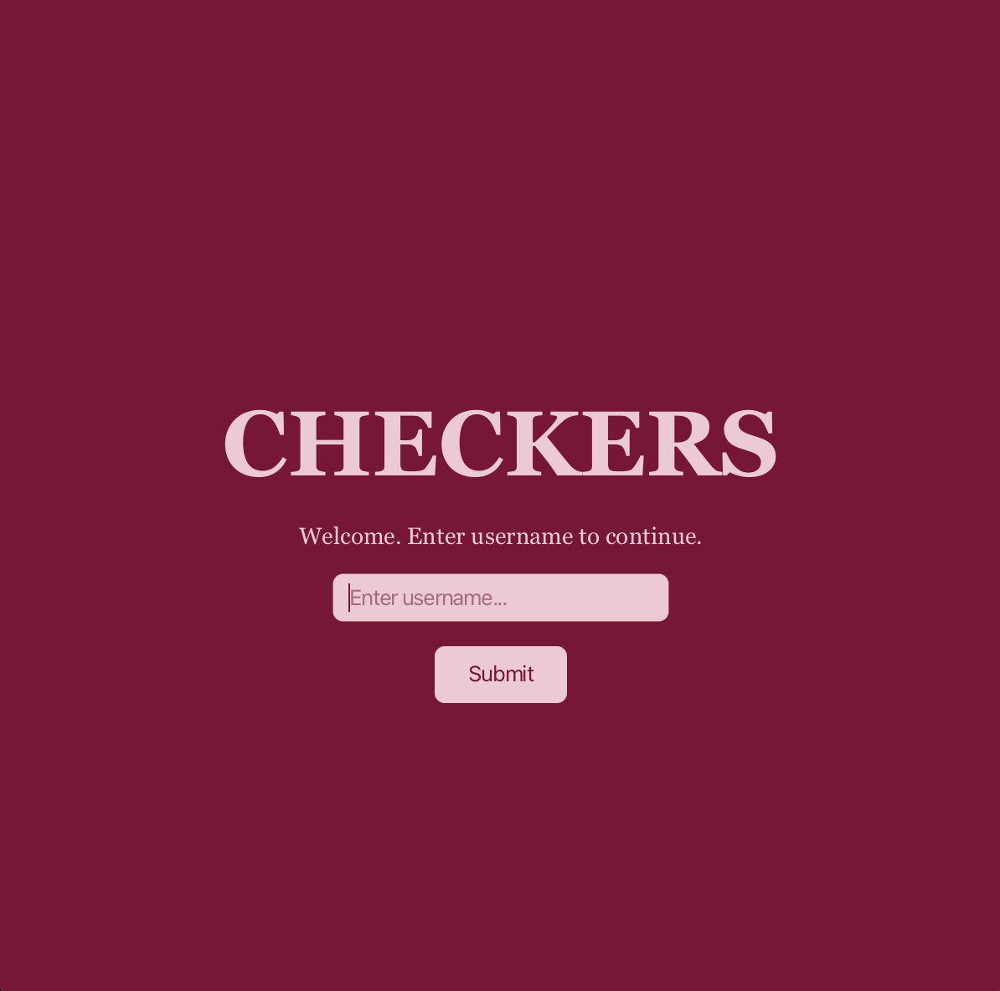
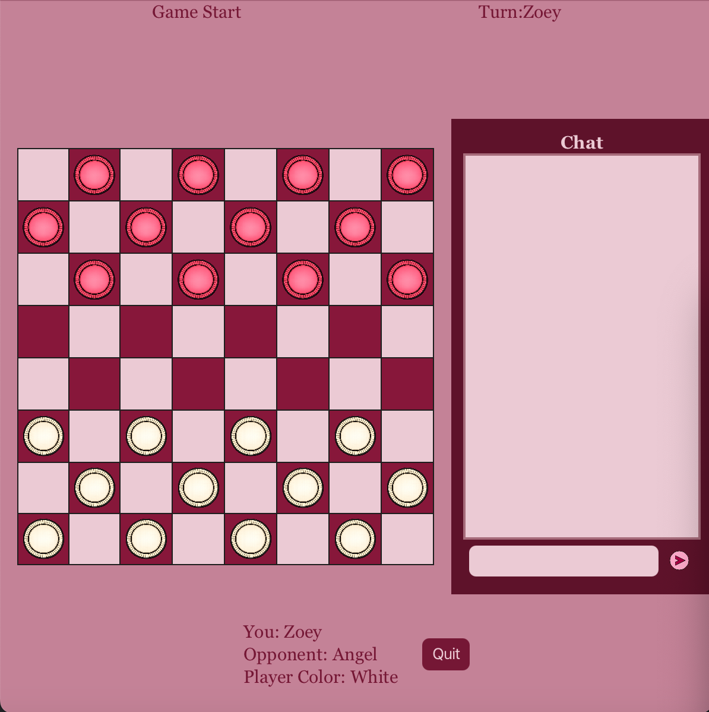
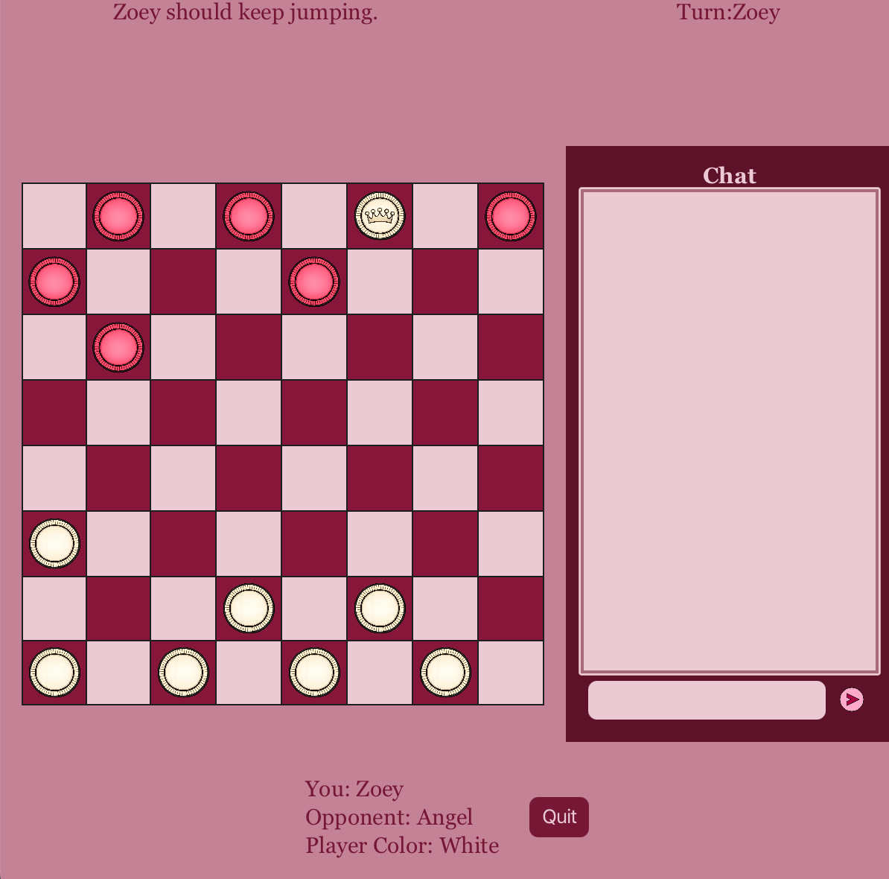
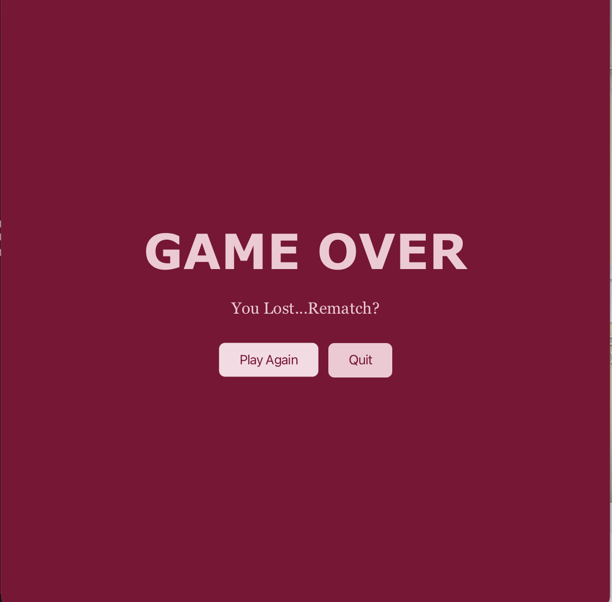
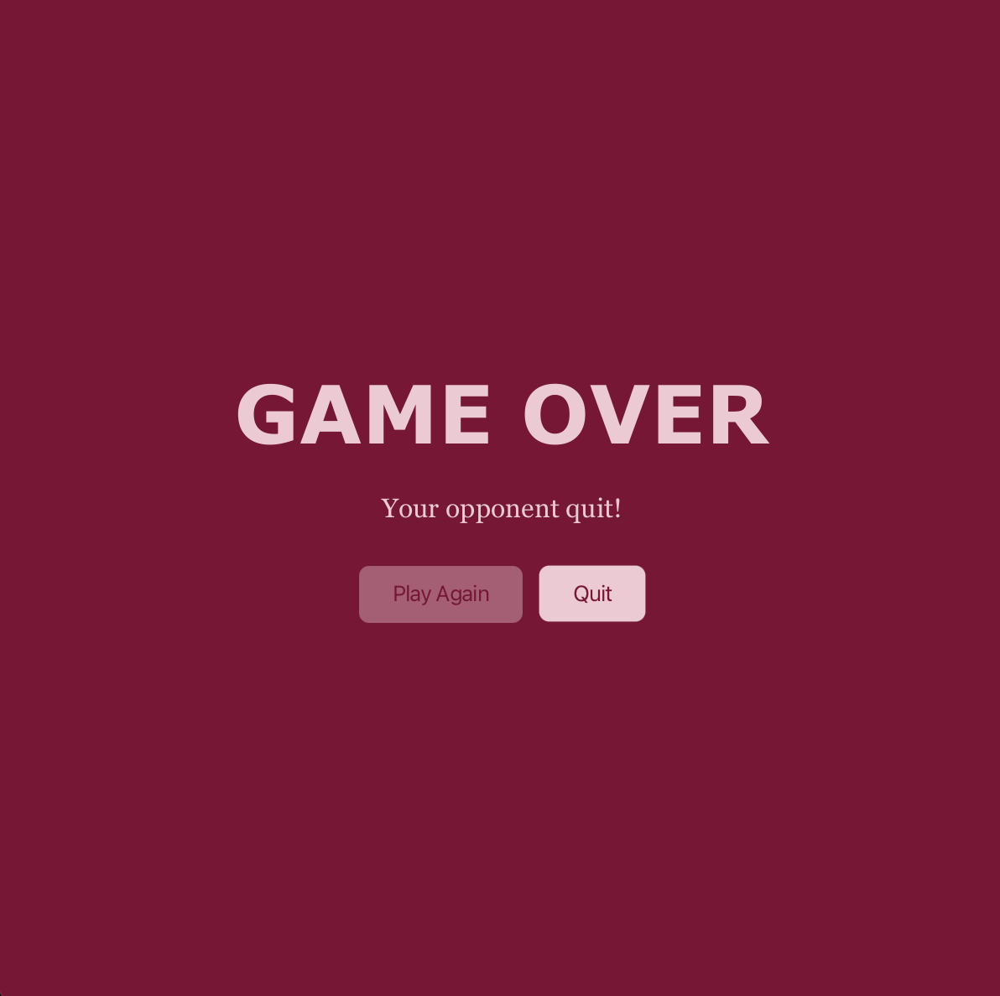

# Checkers

This is a server-client checkers game I made for my Software Design class.[^1] 
The first commit is what I offically submitted for the project. My goal here is just to refactor and clean up the code.

## Screenshots

[^1]: I have permission from the professor to post it on here since he uses a different game each semester,
